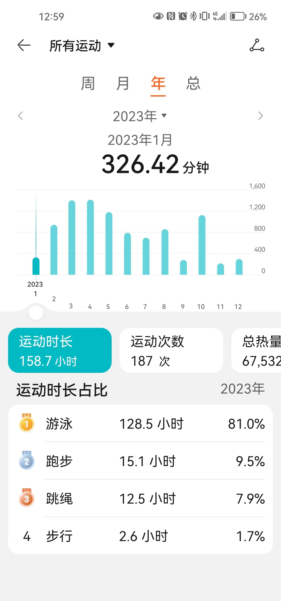

### 2023总结
+ 转眼间2023年已经过去了，时间过的飞快，很快就迎接了2024年，回首 `2023` 年，经历了好多问题，越来越感觉世事艰难，越来越意识到自己身上肩负的责任，`中年负重前行` 是一个绕不开的话题。有一天，我也会老去，也会遇到很多很多的烦心事需要自己处理，很难说自己现在有什么深思远虑，光是眼前的各种事情都让人焦头烂额，工作、家庭、健康哪个都让自己分散太多精力。

唯一不变的需要坚持三条基本原则：
+ 家庭：照顾好家庭，家庭永远排第一，永远爱护自己的两个宝贝；
+ 学习：养成终生学习的好习惯，学技术，学外语，学管理知识，学历史；及时向外学习，及时
+ 健康：吃健康的食物，养成良好的作息，坚持锻炼身体，有病及时就医；
+ 事业：坚持技术导向，坚持踏实前行，坚持遵纪守法，坚持与人为善；
仔细思考这一年的过往经历，这一年经历了许多难熬的时刻，经历了许多大事记，细细的记录下：
+ **买二套房**：一生难买几次房，目前已经经历了买二套房，依稀还记得`2014`年的时候，当时手上只有几千块钱就买了第一套房子，回想起来那个时候真是艰难，那半年几乎是靠着信用卡度日，最冷的冬天连棉服都买不起只能冻着，最苦的日子还是熬过去了。 今年最大的事情是成功买了二套房，买了个三室一厅的大房子，终于可以单独搬出来住大房子了，不必跟老人住在一起整天闹矛盾消耗自己的负面情绪，让自己更加专注于做技术和学习上的事情。虽然确实压力山大，背着几十万的外债，但是总体感觉压力是有，风险可控。虽然压力山大，但是每天住着大房子，心情舒畅，不用每天跟着老人住在一起天天闹矛盾，心里面压抑。感觉宁愿身体上累点苦点，都不愿意心里压抑。
+ **子女生病**：这一年家庭经历了许多变故，老大确认了哮喘，每个月都要坚持花钱治疗。两个小朋友这一年太不让人省心了，经历甲流、支原体肺炎各种折腾，有时候难得可以享受一个完整的周末，经常是家里和医院两头跑，也因为两个小朋友生病家庭闹了不少矛盾。希望新的一年两个宝贝能够少一些生病，不要再天天花钱去医院。
+ **亲人去世**：前几年是上上辈的亲人们去世，爷爷奶奶，姥爷们基本上全都都走了。真是感觉时光易逝，要珍惜时光。今年竟然舅舅辈的亲人走了一个，后面几年估计上一辈的亲人们都慢慢的离我们远去了。真是一个悲伤的话题，几个舅舅曾经身体都很好，结果现在都慢慢老去，都遇到了生活或者健康的坎，感叹世事不易啊，哪有什么顺风顺水，岁月静好，只不过有是有人替你负重前行罢了。
+ **工作重任**：今年以来感觉是进公务员以来加班最多的了，细数一下，全年准点下班的时候估计不超过 `20` 天，各种突发任务，各种应急任务，有时候真心觉得压力山大。每次放假时，都尽量不再想工作山的烦心事，享受好当下片刻的宁静即可。历经了各种发言考核，准备材料，准备党组会议事项等等。

+ [2022总结](https://mike-box.github.io/2023/01/05/%E4%B8%AA%E4%BA%BA%E9%97%B2%E8%B0%88/81/)
+ [2020总结](https://mike-box.github.io/2022/11/20/%E4%B8%AA%E4%BA%BA%E9%97%B2%E8%B0%88/79/)
#### 生活流水账
+ `1`月份就一直开始各种看房，想着赶紧看着合适的房子。突然 `1` 月底国家放开了房贷政策，二套可以首付三成且贷款可以使用公积金的政策，就一直在不停的各种看房在；`3` 月份开始网签合同，并开始办理贷款。`5` 月开始还房贷，`6` 月份在我们的催促下，卖方终于交房了。整个 `6,7,8,9` 月都是在不停的折腾房子，对房子内部各种进行修复，买各种家电，买床，买各种配套的东西，终于 `9` 月份可以住进来了。
+ 今年已经数不清带着两个小朋友去了多少次医院了，花钱是小问题，几个大人都折腾的够呛，每次生病住院都像打仗一样，各种不得安宁，依稀记得 `3` 月到 `5` 月是各种甲流和合胞病毒乱七八糟的，小姑娘一直各种咳诉，莫名奇妙就肺炎住院了。`7，8` 月份夏天的时候莫名其妙两个又开始轮流生病。到了 `10` 月份的时候就更严重了，两个小宝贝一起去医院，因为支原体肺炎的原因导致两个小朋友的身体特别脆弱，经常需要往医院来回跑，老大住了一个星期的医院，老二打针打了 `9` 天，感觉每次最担心的就是两个小朋友生病，各种医院来回跑，心里和身体都是达到极限。
+ `10` 月份经历了亲人去世，感觉特别难受，因为这是最近几年差不多第二个去世的上一辈的亲戚了。尤其记着，亲人见面的次数越来越少了，丧事能回家的尽量要回家见见亲人最后一面。真是不容易。
+ 全年的工作压力特别大，啃下了几个难啃的骨头，所幸的事终于熬过去了，也有过几乎通宵的时候，急难险重的任务只能自己扛着，希望新的一年工作压力不要这么大，能够让自己抽出时间来解决一些长期问题。
#### 家庭
+ 今年变化最快的是大宝，今年开始上小学了。感觉儿子有了长大的迹象，慢慢也有自己的思考能力了，不像之前糊里糊涂的。可能太不关注小朋友了，感觉他非常讨厌幼儿园的生活，自从上了小学以后就特别开心，每天特别喜欢上学。刚开始还担心他适应不了学校的生活，看来我们多想了，小孩子的适应能力还是很强，很快就习惯了校园生活，也习惯了跟小朋友们的打闹追逐。学习上虽然感觉学习接受能力比较慢，比不上我们当年的时候，但是总体只要开头可以跟上老师的进度就非常满意了。

+ 小宝今年已经满4岁了，女儿真的是父母的小棉袄，每天看着她很开心长大的长大，永远像个贴心的小棉袄让人喜欢。每天回家最开心的时候是听到女儿开心的叫爸爸，身上的责任感越来越重了。
+ 老父亲今年已经`79`岁高龄了，老父亲真的越来越苍老了，仔细数一下，今年竟然没有专门回家看望老父亲，真是不孝，今年过年一定把老父亲接过来过个年，好好陪陪见见两个孙子孙女，带他到医院好好看看，真心觉得太亏欠父母了。
+ 最后是老婆，岳父，岳母。有时候看到`LD`不到四十岁，却身材走形，皮肤变样，真心是这几年操累的太严重了，感觉老了好多岁，身体和精力也越来越差。岳父岳母在两个小孩上学后，需要操心的越来越少了，也该让他们好好休息休息安享晚年。
+ 对于自身来说，其实内心非常的焦虑。因为在自己最需要金钱的时候，而没有能力提供一个很好的经济基础，能够让自己的家人过上幸福的日子。感觉可以供自己分配的时间越来越少，大部分时间都被家庭、工作给分开了，很少有自己单独享受学习的时候。经过两年的努力，感觉刷题和题解维护压力已经几乎越来越没有了，写题解的同时掌握了 `Go,JS, python` 的语法，让自己使用 `python` 越来越熟练，越来越喜欢这门语言。残酷刷题群已经满一年了，不过好在水平足够几乎周赛没有出现过垫底的机会，大部分时间都保持在中游水平，主要是没时间专心来搞刷题这件事，大部分都维持在 `1000` 名开外，主要还是没有时间，连完整参加周赛的时间都没有，经常是周赛参加一半就因为各种事出去确实没时间。细数一下，可惜的是今年的学习任务大部分都没有完成，主要是没有时间。

#### 健康
+ 2023年的整体健康水平尚可，但还是明显感觉身体精力下降的趋势，明显的是一周不锻炼身体，精力明显下降，脾气明显暴躁，最大的成就是终于治好了多年的脚气问题，摆脱脚气这个难缠的毛病了，陆续除了一些新的小毛病，比如吃太饱就容易消化不良导致胃胀，小腿内侧莫名其妙开始湿疹，夜间睡眠出现低通气症状等等一些问题都需要自己去解决。

+ 2023年合计运动187次，运动时间158.7小时，当然绝对部分时间都是在游泳，越来越喜欢游泳这个运动了，非常让人放松的一种运动。

细数一下今年去医院的大事记：
+ `8` 月份去医院看自己的脚气，好在通过坚持抹药膏，自己的脚气竟然就好了。
+ `10` 月份莫名其妙发现几次睡觉期间被憋醒的症状，去医院复查才发现是自己夜间出现低通气症状导致睡觉期间憋醒，试着带了下呼吸机睡觉，实在太不舒服了，就把呼吸机去掉了，等到明年有钱之后再开始折腾呼吸机，目前暂时通过坚持锻炼来减少睡眠呼吸暂停的次数吧。

#### 工作
+ 今年的工作可以说压力山大，各种乱起八。
+ 在当前的大环境下，体制内的工作的收入竟然递减，只能靠自己去开源节流。现实环境如此，只能依靠自己的想法去改变和拓展边界，靠山靠水不如靠自己，自己从小是从苦日子中长大的，面对所有的艰辛和困难都不会轻易屈服。自己从2021年开始兼任了力扣官方题解的创作者，从刚开始的挑战，到现在能够稳定的应对和输入质量较高的题解，感觉人都是能够适应的。挑战越大，适应能力也会越强。
  
#### 读书学习
+ 年终给自己定了很多目标，完成情况只能说差强人意。不过从9月份到10月份的锻炼计划还是完成的不错，基本上能够保持每周不少于3次的锻炼，当然今年做的比较差的是没有及时的更新锻炼记录，今年将会持续的更新锻炼记录。今年比较坑的是，各种疫情影响，健身房动不动就关门，特别是12月感染新冠以后，身体还是没有恢复到最佳状态，还是需要继续努力和加强。
+ 关于读书方面，今年下半年的目标本来计划是读`30`本书，今年做的太差了，买了许多书，却完成的不好，主要还是各种计划赶不上变化，时间太宝贵了，基本上不够用。
+ 关于技术方面的学习，每周还是坚持刷题，今年感觉基本上坚持完成了全年所有的`leetcode`的题解，感觉收获还是挺大，不知道是自己水平提高了还是力扣的题目变简单了，目前基本上百分之七十的周赛都能`AK`l了，并且感觉力扣的题目越来越水了，感觉没有太多新颖的题目，太过于套路和模板化了。当然今年自己继续担任力扣的官方题解成员，并且兼职完成了力扣`book` 《C++面试指南》，感觉当时快痛苦死了，当时实在太忙了，没有想到工作量那么大，感觉差点都完不成了，还好最终赶在 `dead line` 之前完成了，感觉自己的能力确实得到了提升，对于`C/C++`的理解更深了一些，能力确实是靠自己逼自己才能成长的。所以自己索性加入了残酷刷题群，希望自己能够更好的在残酷刷题群中生存下来。
+ 关于技术课程方面，今年完成的公开课的课程真心不够，不过确实限制于时间的问题，自己没有很多时间来完成大的`project`，今年各种断断续续，终于把 《MIT6.S081》的11个lab全部完成了，关于[MIT6.S081](https://www.zhihu.com/column/c_1385344375300390912)的内容全部放在知乎上，还好自己坚持了下来。
+ 今年会陆续更新新的一年中的锻炼计划与读书计划、学习计划，将作为新的一遍文章更新中。
  
#### 展望
+ 展望2023年，首先希望家里两个可爱的宝宝健康成长，父母能够身体健康，自己身体健康工作顺利，老婆顺利升职，顺利换个大房子，将爸爸接到身边来，乘着岁月静好好好享受生活。
+ 希望自己能够实现自己所定的小目标，积极改善家庭经济条件，改善父母关系，改善夫妻之间的关系。
+ 希望自己能够完成新的一年中锻炼计划、学习计划、读书计划。

欢迎关注和打赏，感谢支持！
+ 关注我的博客: http://whistle-wind.com/
+ 关注我的知乎：https://www.zhihu.com/people/da-hua-niu
+ 关注我的微信公众号: 公务程序猿

