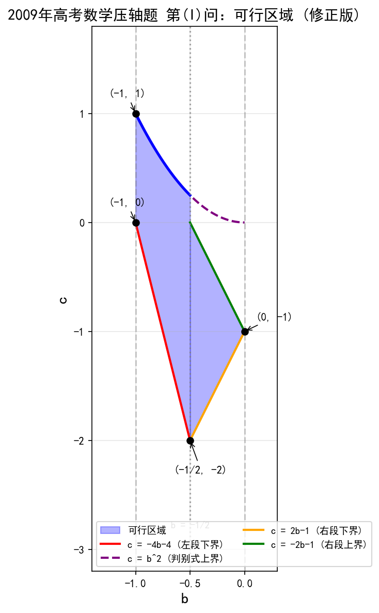

#### 题目描述

# 2009 年高考数学压轴题目

设函数 $f(x) = x^3 + 3bx^2 + 3cx$ 有两个极值点 $x_1, x_2$，且 $x_1 \in [-1, 0]$，$x_2 \in [1, 2]$。

（Ⅰ）求 $b, c$ 满足的约束条件，并在下面的坐标平面内，画出满足这些条件的点 $(b, c)$ 的区域。

（Ⅱ）证明：$-10 \leq f(x_2) \leq -\frac{1}{2}$。

#### 详细题解

（Ⅰ）求 $b, c$ 满足的约束条件，并在下面的坐标平面内，画出满足这些条件的点 $(b, c)$ 的区域。

+ 对函数 $f(x)$ 求导，可知：$f'(x) = 3x^2 + 6bx + 3c = 3(x^2 + 2bx + c)$。令 $f'(x) = 0$，即 $x^2 + 2bx + c = 0$，其判别式 $\Delta = 4b^2 - 4c \ge 0$，即 $c \le b^2$。两根为：
  $$
  x_{1,2} = -b \pm \sqrt{b^2 - c}
  $$
  不妨设 $x_1 = -b - \sqrt{b^2 - c}$，$x_2 = -b + \sqrt{b^2 - c}$（$x_1 < x_2$）。

  由 $x_1 \in [-1, 0]$ 和 $x_2 \in [1, 2]$ 分别得到：
  $$
  \begin{cases}
  -1 \le -b - \sqrt{b^2 - c} \le 0 \\[4pt]
  1 \le -b + \sqrt{b^2 - c} \le 2
  \end{cases}
  \quad\Rightarrow\quad
  \max(-b,\, 1+b) \le \sqrt{b^2 - c} \le \min(1-b,\, 2+b)
  $$

  为使不等式有解，需 $\max(-b, 1+b) \le \min(1-b, 2+b)$。由 $1+b \le 1-b$ 得 $b \le 0$，由 $-b \le 2+b$ 得 $b \ge -1$，故 $b \in [-1, 0]$。

  **分段讨论**（比较 $-b$ 与 $1+b$ 的大小，分界点为 $b = -\frac{1}{2}$）：

  - **当 $b \in [-1, -\frac{1}{2}]$ 时**：$-b \ge 1+b$，$\min(1-b, 2+b) = 2+b$。有：
    $$-b \le \sqrt{b^2 - c} \le 2+b$$
    平方得 $b^2 \le b^2 - c \le (2+b)^2$，即 $c \le 0$ 且 $c \ge -(4+4b+b^2) + b^2 = -4b-4$。
    综上 $c \in [-4b-4,\; b^2]$（$c \le b^2$ 由判别式给出，而 $-4b-4 \le 0 \le b^2$）。

  - **当 $b \in [-\frac{1}{2}, 0]$ 时**：$1+b \ge -b$，$\min(1-b, 2+b) = 1-b$。有：
    $$1+b \le \sqrt{b^2 - c} \le 1-b$$
    平方得 $(1+b)^2 \le b^2 - c \le (1-b)^2$，即 $1+2b+b^2 \le b^2 - c \le 1-2b+b^2$，化简得 $2b-1 \le c \le -2b-1$。
    同时需满足 $c \le b^2$，验证 $-2b-1 \le b^2$（即 $(b+1)^2 \ge 0$ 恒成立）。
    综上 $c \in [2b-1,\; -2b-1]$。

  最终约束条件为：
  $$
  \boxed{
  \begin{aligned}
  &b \in [-1, 0], \\[4pt]
  &c \in \begin{cases}
  [-4b-4,\; b^2], & b \in [-1, -\frac{1}{2}] \\[6pt]
  [2b-1,\; -2b-1], & b \in [-\frac{1}{2}, 0]
  \end{cases}
  \end{aligned}
  }
  $$

  如图所示，蓝色填充区域即为满足约束条件的点 $(b, c)$ 的可行域。区域由 $b \in [-1, 0]$ 限定横轴范围，纵轴上下界为分段函数：左半段由直线 $c = -4b-4$ 和抛物线 $c = b^2$ 围成，右半段由直线 $c = 2b-1$ 和 $c = -2b-1$ 围成。四个角点分别为 $(-1, 0)$、$(-1, 1)$、$(-\frac{1}{2}, -2)$、$(0, -1)$。

（Ⅱ）证明：$-10 \leq f(x_2) \leq -\frac{1}{2}$。

由 $f'(x) = 3x^2 + 6bx + 3c$，令 $f'(x) = 0$，由于 $x_1, x_2$ 是 $f(x)$ 的两个极值点，故 $x_1, x_2$ 是方程 $x^2 + 2bx + c = 0$ 的两个实根。

由韦达定理可得：
$$
x_1 + x_2 = -2b, \quad x_1x_2 = c
$$

将 $b = -\dfrac{x_1 + x_2}{2}$ 和 $c = x_1x_2$ 代入 $f(x_2) = x_2^3 + 3bx_2^2 + 3cx_2$：

$$
\begin{aligned}
f(x_2) &= x_2^3 + 3\left(-\frac{x_1 + x_2}{2}\right)x_2^2 + 3(x_1x_2)x_2 \\
&= x_2^3 - \frac{3x_1x_2^2}{2} - \frac{3x_2^3}{2} + 3x_1x_2^2 \\
&= -\frac{x_2^3}{2} + \frac{3x_1x_2^2}{2} \\
&= \frac{x_2^2}{2}(3x_1 - x_2)
\end{aligned}
$$

由于 $x_1 \in [-1, 0]$，$x_2 \in [1, 2]$，对于固定的 $x_2$，$f(x_2) = \dfrac{x_2^2}{2}(3x_1 - x_2)$ 关于 $x_1$ 单调递增（$\dfrac{3x_2^2}{2} > 0$）。

因此 $f(x_2)$ 的取值范围为：

- **下界**：当 $x_1 = -1$ 时，$f(x_2) = -\dfrac{x_2^2(x_2 + 3)}{2}$，此函数在 $x_2 \in [1, 2]$ 上单调递减，故当 $x_1 = -1$，$x_2 = 2$ 时取得最小值：
  $$f_{\min} = -\frac{2^2 \times (2 + 3)}{2} = -10$$

- **上界**：当 $x_1 = 0$ 时，$f(x_2) = -\dfrac{x_2^3}{2}$，此函数在 $x_2 \in [1, 2]$ 上单调递减，故当 $x_1 = 0$，$x_2 = 1$ 时取得最大值：
  $$f_{\max} = -\frac{1^3}{2} = -\frac{1}{2}$$

综上，$-10 \leq f(x_2) \leq -\dfrac{1}{2}$。证毕。

---

#### 总结

题目还是非常难，需要非常仔细的水平。

